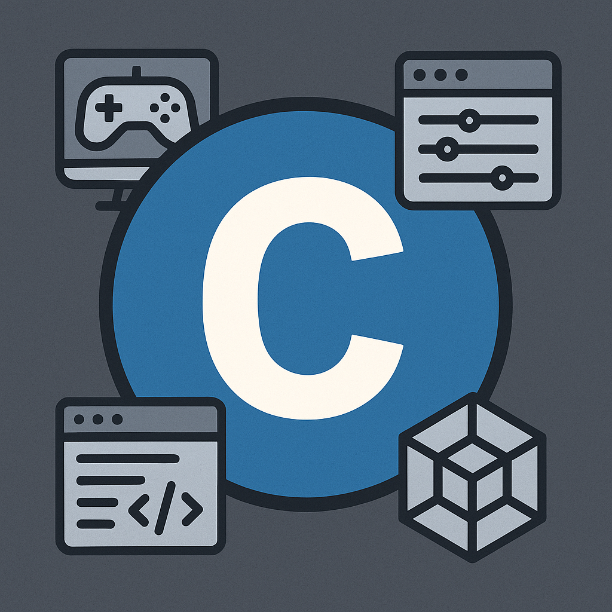

<p align="center">
  
</p>

<p align="center">
  <a href="https://github.com/dunamismax/c-learning-demos">
    
  </a>
</p>

<p align="center">
  <a href="https://clang.llvm.org/"></a>
  <a href="https://en.wikipedia.org/wiki/C11_(C_standard_revision)"></a>
  <a href="https://developer.apple.com/documentation/apple-silicon"></a>
  <a href="https://opensource.org/licenses/MIT"></a>
  <a href="https://github.com/dunamismax/c-learning-demos/pulls"></a>
  <a href="https://github.com/dunamismax/c-learning-demos/stargazers"></a>
</p>

---

## About This Project

A **comprehensive C programming learning repository** featuring production-quality code examples, libraries, and applications designed for educational purposes. This repository demonstrates modern C programming practices with progressive complexity from beginner to advanced concepts.

**Key Features:**

- **Educational Focus**: Extensively documented code with learning objectives clearly explained
- **Progressive Difficulty**: Structured path from basic concepts to advanced system programming
- **Production Quality**: Memory-safe, security-hardened code following industry best practices
- **Comprehensive Libraries**: Reusable data structures, algorithms, and utilities
- **Real-World Applications**: Interactive tools demonstrating practical C programming
- **ARM64 Optimized**: Apple Silicon-specific optimizations with advanced compiler flags
- **Complete Test Suite**: Custom testing framework with comprehensive coverage
- **Professional Build System**: Intelligent Makefile with auto-discovery and parallel builds
- **Cross-Platform**: Support for macOS, Linux, and other Unix-like systems

---

## Quick Start

### Prerequisites

**Required Dependencies:**

```bash
# macOS (Primary Platform)
xcode-select --install

# Ubuntu/Debian
sudo apt-get install build-essential clang make git

# Fedora/RHEL
sudo dnf install clang make git

# Arch Linux
sudo pacman -S base-devel clang make git

# Optional development tools
brew install clang-format llvm lcov    # macOS
```

### Installation & Setup

```bash
# Clone repository
git clone https://github.com/dunamismax/c-learning-demos.git
cd c-learning-demos

# Build everything
make                          # Release mode (default)
make MODE=debug              # Debug with sanitizers
make MODE=profile            # Profile build

# Run tests
make test                    # Build and run comprehensive test suite
```

### Start Learning

```bash
# Begin with Hello World
make run-hello_world

# Try the interactive calculator
make run-calculator

# Explore file operations
make run-file_manager

# Analyze text files
make run-text_analyzer document.txt

# Generate secure passwords
make run-password_generator
```

---

## Learning Path

### Beginner Level - Core Concepts

**Start Here for C Fundamentals:**

```bash
# 1. Hello World - C syntax and basic I/O
./build/release/bin/hello_world

# 2. Calculator - Interactive math operations
./build/release/bin/calculator

# 3. Number Guessing Game - Control flow and logic
./build/release/bin/number_guessing

# 4. Password Generator - String manipulation
./build/release/bin/password_generator

# 5. Text Analyzer - File I/O and statistics
./build/release/bin/text_analyzer sample.txt
```

**Learning Objectives:**

- Variable declarations and basic data types
- Input/output operations and formatting
- Control flow structures (if/else, loops, switch)
- Functions and parameter passing
- Arrays and string manipulation
- Basic file operations

### Intermediate Level - System Programming

**Advance to System-Level Programming:**

```bash
# 1. File Manager - System calls and directory operations
./build/release/bin/file_manager

# 2. JSON Parser - Parsing algorithms and data structures
./build/release/bin/json_parser data.json

# 3. Network Client - Socket programming (planned)
# 4. Memory Pool - Advanced memory management (planned)
```

**Learning Objectives:**

- System programming with POSIX APIs
- Advanced file and directory operations
- Parsing algorithms and recursive descent
- Dynamic memory management
- Error handling and defensive programming

### Advanced Level - Complex Systems

**Master Advanced Programming Concepts:**

```bash
# 1. Database Engine - Storage and indexing (planned)
# 2. Compiler - Lexical analysis and parsing (planned)
# 3. Web Server - Network programming and HTTP (planned)
# 4. Thread Pool - Concurrent programming (planned)
```

**Learning Objectives:**

- Database storage and indexing systems
- Compiler construction and language processing
- Network programming and protocol implementation
- Concurrent programming and synchronization

---

## Architecture & Libraries

### Core Libraries

**Utils Library (`libutils.a`):**

```c
#include "utils.h"

// Safe string operations
char* safe_strdup(const char* str);
bool safe_strcat(char* dest, const char* src, size_t dest_size);

// Memory management
void* safe_calloc(size_t count, size_t size);
void secure_free(void* ptr, size_t size);

// Input validation
bool str_to_int(const char* str, int* result);
bool is_numeric(const char* str);
char* trim_whitespace(char* str);
```

**Data Structures Library (`libdata_structures.a`):**

```c
#include "dynamic_array.h"
#include "linked_list.h"
#include "stack.h"

// Dynamic array operations
DynamicArray* darray_create(size_t element_size, size_t initial_capacity);
bool darray_push(DynamicArray* arr, const void* element);
bool darray_get(const DynamicArray* arr, size_t index, void* element);

// Linked list operations
LinkedList* list_create(size_t element_size);
bool list_push_front(LinkedList* list, const void* element);
bool list_find(const LinkedList* list, const void* element, compare_func_t compare);

// Stack operations
Stack* stack_create(size_t element_size, size_t initial_capacity);
bool stack_push(Stack* stack, const void* element);
bool stack_pop(Stack* stack, void* element);
```

**Algorithms Library (`libalgorithms.a`):**

```c
#include "algorithms.h"

// Sorting algorithms
void quick_sort(void* array, size_t size, size_t element_size, compare_func_t compare);
void merge_sort(void* array, size_t size, size_t element_size, compare_func_t compare);
void bubble_sort(void* array, size_t size, size_t element_size, compare_func_t compare);

// Search algorithms
size_t binary_search(const void* array, size_t size, size_t element_size,
                     const void* target, compare_func_t compare);
size_t linear_search(const void* array, size_t size, size_t element_size,
                     const void* target, compare_func_t compare);

// Array operations
void reverse_array(void* array, size_t size, size_t element_size);
void shuffle_array(void* array, size_t size, size_t element_size);
```

### Application Architecture

**Design Patterns Demonstrated:**

- **Constructor/Destructor**: Consistent resource management
- **State Machines**: Clean program flow control
- **Error Handling**: Comprehensive validation and recovery
- **Memory Safety**: Bounds checking and leak prevention
- **Modular Design**: Clear separation of concerns

---

## Build System

Professional cross-platform Makefile with ARM64 optimization and educational features.

### Core Commands

```bash
# Building
make                       # Build libraries and applications
make libs                  # Build shared libraries only
make apps                  # Build applications only
make clean                 # Clean build artifacts

# Testing
make test                  # Build and run comprehensive test suite
make build-tests           # Build tests without running

# Development
make MODE=debug            # Debug build with sanitizers
make MODE=profile          # Profile build with coverage
make format                # Format code with clang-format
make lint                  # Run static analysis

# Running applications
make run-hello_world       # Run Hello World example
make run-calculator        # Run interactive calculator
make run-file_manager      # Run file manager
```

### Optimization Features

- **Apple Silicon**: ARM64-specific optimizations (`-mcpu=apple-m1 -mtune=apple-m1`)
- **Link-Time Optimization**: Smaller, faster binaries in release builds (`-flto=thin`)
- **Parallel Builds**: Automatically uses all CPU cores
- **Smart Discovery**: Auto-detects source files and dependencies
- **Security Hardening**: Stack protection and memory sanitizers
- **Educational**: Debug symbols and verbose error messages

---

## Testing & Quality

### Comprehensive Test Suite

**Custom Testing Framework:**

```c
#include "test_framework.h"

TEST_CASE(example_test) {
    int result = 2 + 2;
    ASSERT_EQ(4, result);
    ASSERT_TRUE(result > 0);
    ASSERT_STR_EQ("hello", "hello");
    TEST_SUCCESS();
}

void run_tests(void) {
    RUN_TEST(example_test);
}

TEST_MAIN()
```

**Test Categories:**

```bash
# Unit tests - Individual function testing
./scripts/run_tests.sh --unit-only

# Integration tests - Application workflow testing
./scripts/run_tests.sh --integration

# Performance tests - Algorithm benchmarking
./scripts/run_tests.sh --performance

# All tests with coverage
./scripts/run_tests.sh --coverage
```

### Code Quality Standards

**Static Analysis:**

- **clang-tidy**: Comprehensive static code analysis
- **AddressSanitizer**: Runtime memory error detection
- **UndefinedBehaviorSanitizer**: Undefined behavior detection
- **Coverage Analysis**: Line and branch coverage reporting

**Best Practices:**

- **Memory Safety**: Proper allocation/deallocation patterns
- **Input Validation**: Comprehensive bounds checking
- **Error Handling**: Graceful failure and recovery
- **Documentation**: Extensive comments and examples

---

## Educational Value

### Learning Objectives by Component

**Memory Management:**

- Dynamic allocation and deallocation strategies
- Memory leak prevention and detection
- Buffer overflow protection techniques
- Stack vs heap usage patterns

**Data Structures:**

- Array operations and dynamic resizing
- Linked list traversal and manipulation
- Stack and queue implementations
- Hash table concepts and collision handling

**Algorithms:**

- Sorting algorithm complexities and trade-offs
- Search algorithm optimization
- Recursive vs iterative approaches
- Big O notation in practice

**System Programming:**

- File I/O and error handling
- Process management and signals
- Network programming concepts
- Cross-platform compatibility

### Code Examples and Patterns

**Error Handling Pattern:**

```c
// Demonstrated throughout the codebase
bool safe_operation(const char* input, char* output, size_t output_size) {
    if (!input || !output || output_size == 0) {
        return false;  // Input validation
    }

    // Operation with error checking
    if (some_system_call() != 0) {
        log_message("ERROR", "System call failed");
        return false;
    }

    return true;
}
```

**Resource Management Pattern:**

```c
// Constructor/Destructor pattern
Resource* resource_create(size_t size) {
    Resource* res = safe_calloc(1, sizeof(Resource));
    if (!res) return NULL;

    res->data = safe_calloc(size, sizeof(char));
    if (!res->data) {
        free(res);
        return NULL;
    }

    return res;
}

void resource_destroy(Resource* res) {
    if (res) {
        free(res->data);
        free(res);
    }
}
```

---

## Project Structure

```
c-learning-demos/
├── apps/                     # Educational applications
│   ├── beginner/            # Basic concepts
│   │   ├── hello_world/     # C fundamentals
│   │   ├── calculator/      # Interactive math
│   │   ├── number_guessing/ # Game logic
│   │   ├── password_generator/ # String manipulation
│   │   └── text_analyzer/   # File I/O
│   ├── intermediate/        # System programming
│   │   ├── file_manager/    # File operations
│   │   ├── json_parser/     # Parsing algorithms
│   │   ├── network_client/  # Socket programming
│   │   └── memory_pool/     # Memory management
│   └── advanced/            # Complex systems
│       ├── database_engine/ # Storage systems
│       ├── compiler/        # Language processing
│       ├── web_server/      # Network programming
│       └── thread_pool/     # Concurrent programming
├── libs/                    # Shared libraries
│   ├── utils/              # Utility functions
│   ├── data_structures/    # Data structure implementations
│   └── algorithms/         # Algorithm implementations
├── tests/                   # Comprehensive test suite
│   ├── unit/               # Unit tests
│   ├── integration/        # Integration tests
│   └── performance/        # Performance benchmarks
├── scripts/                # Build and utility scripts
├── docs/                   # Documentation
├── build/                  # Build artifacts (generated)
└── Makefile               # Professional build system
```

### Technology Stack

- **Language**: C11 standard with ARM64-specific optimizations
- **Compiler**: Clang with educational debugging features
- **Build System**: GNU Make with intelligent dependency tracking
- **Testing**: Custom lightweight testing framework
- **Documentation**: Comprehensive inline comments and examples
- **Quality**: Static analysis and runtime error detection

---

## Contributing

Contributions welcome! This project aims to be the definitive C learning resource.

### Development Guidelines

```bash
# Setup development environment
git clone https://github.com/dunamismax/c-learning-demos.git
cd c-learning-demos
make MODE=debug

# Before submitting PR
make clean && make
make test
make format lint
```

### Adding New Examples

1. Choose appropriate difficulty level (beginner/intermediate/advanced)
2. Create well-documented, educational code
3. Add comprehensive comments explaining concepts
4. Include unit tests and integration tests
5. Update documentation and learning path

### Code Quality Requirements

- **Educational Value**: Clear learning objectives
- **Production Quality**: Memory-safe, secure code
- **Documentation**: Extensive comments and examples
- **Testing**: Comprehensive test coverage
- **Standards**: Follow C11 best practices

---

## Troubleshooting

### Common Issues

**Build Problems:**

```bash
# Clean rebuild
make clean && make

# Check compiler
clang --version

# Verify dependencies
make help
```

**Learning Path Issues:**

```bash
# Start with basics
make run-hello_world

# Check build mode
make MODE=debug run-calculator

# Verbose build
make V=1
```

**Test Failures:**

```bash
# Run specific test suite
./scripts/run_tests.sh --unit-only

# Debug mode testing
make MODE=debug test

# Check individual tests
./build/debug/bin/test_utils
```

---

## Support This Project

If you find this C Learning Repository valuable for your programming education, consider supporting its continued development:

<p align="center">
  <a href="https://www.buymeacoffee.com/dunamismax" target="_blank">
    
  </a>
</p>

---

## Connect

<p align="center">
  <a href="https://twitter.com/dunamismax" target="_blank"></a>
  <a href="https://bsky.app/profile/dunamismax.bsky.social" target="_blank"></a>
  <a href="https://reddit.com/user/dunamismax" target="_blank"></a>
  <a href="https://discord.com/users/dunamismax" target="_blank"></a>
  <a href="https://signal.me/#p/+dunamismax.66" target="_blank"></a>
</p>

---

## License

This project is licensed under the **MIT License** - see the [LICENSE](LICENSE) file for details.

---

<p align="center">
  <strong>Built with Pure C for Education</strong><br>
  <sub>Comprehensive learning resource for modern C programming</sub>
</p>
